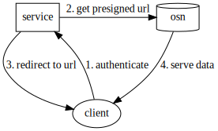

# Sage Object Store

API to access upload data collected from Sage nodes.

URLs to request files from he API have to be in this format:
```console
curl localhost:8080/api/v1/data/<job_id>/<task_id>/<node_id>/<timestamp>-<filename>
```

## Design




The path `<job_id>/<task_id>/<node_id>/<timestamp>-<filename>` reflects how files are stored in the backend S3.

## Testing

```sh
go test
```
